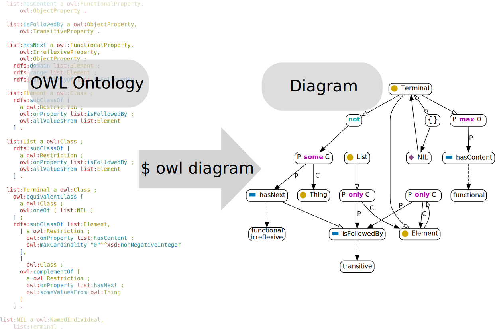

# owl-cli

    

**owl-cli** is a command line tool for ontology engineering. It targets the [Web Ontology
Language](https://en.wikipedia.org/wiki/Web_Ontology_Language) (OWL 2) and
[RDF](https://en.wikipedia.org/wiki/Resource_Description_Framework). You can

* generate a diagram for an OWL ontology with the `diagram command`
* read any RDF document in [RDF/Turtle](https://www.w3.org/TR/turtle/), [RDF/XML](https://www.w3.org/TR/rdf-syntax-grammar/), [RDF N-Triples](https://www.w3.org/TR/n-triples/) or [N3](https://www.w3.org/TeamSubmission/n3/) format and write it in configurable, pretty-printed RDF/Turtle or one of the other formats using the `write command`

## Documentation

Installation instructions and the usage guide can be found in the [Online Documentation](https://atextor.de/owl-cli/).

## Contact

**owl-cli** is developed by Andreas Textor <<mail@atextor.de>>.

